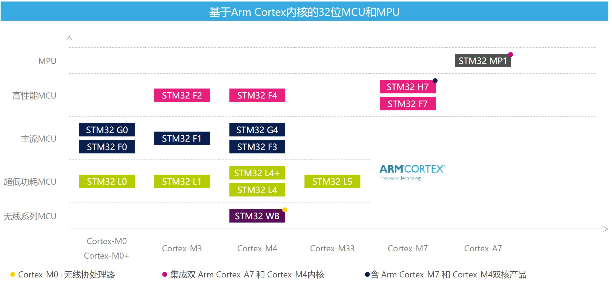
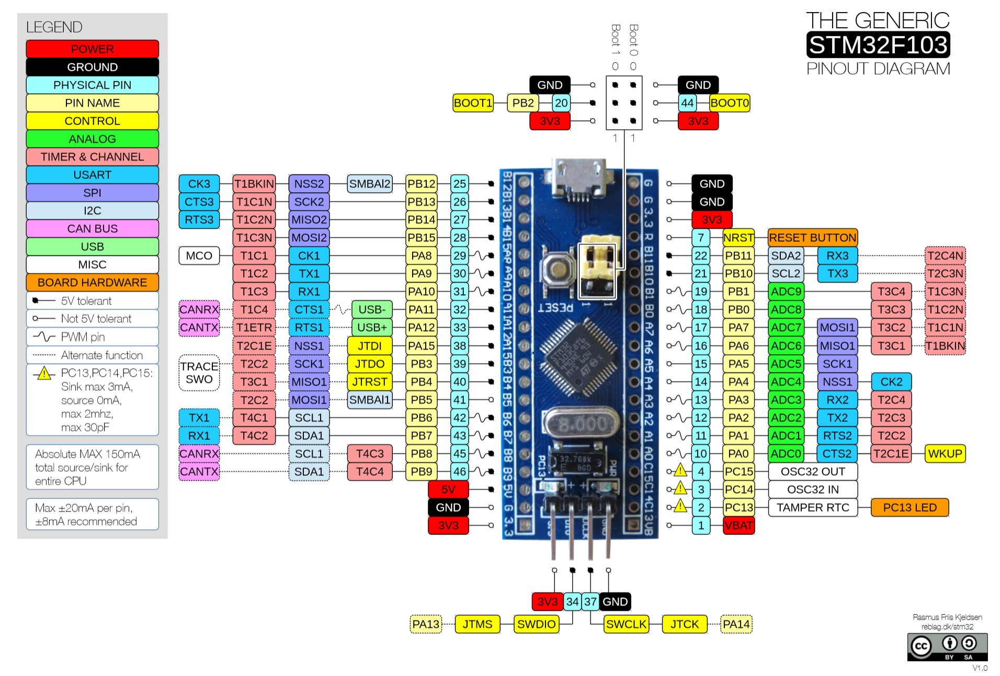
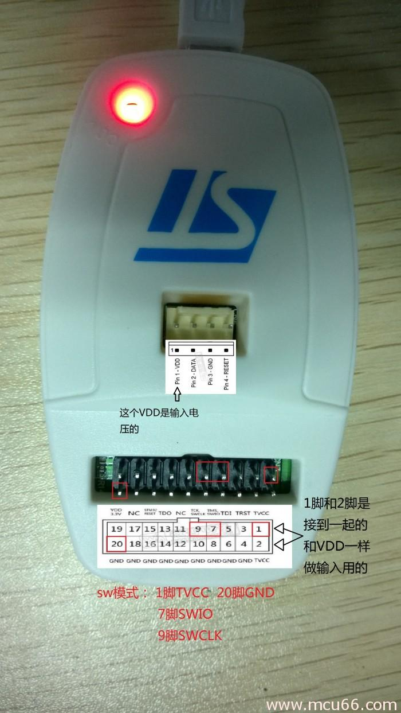
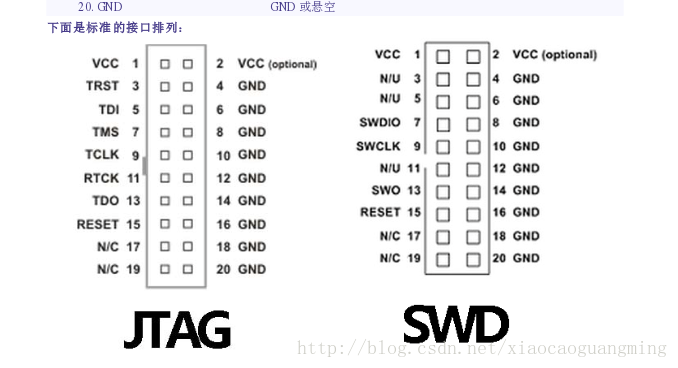

# STM32 Blue Pill  
----  
**STM32**是由ST公司开发的一款高性能、低功耗的32位微控制器。当前市面上非常受欢迎的一款“蓝色药丸(Blue Pill)”核心板就是基于STM32f103c8t6设计的，采用DIP40封装，体型小巧、价格低廉(参考价&yen;10)，相对其他型号的STM32单片机也没有阉割太多外设资源，基本的定时器、串口、I2C、SPI、JTAG/SWD调试接口都有。得益于国内庞大的开发者社区，针对STM32单片机的相关参考资料也非常丰富。为了方便以后的开发，我对“蓝色药丸”相关的软硬件资料进行了一些整理。  
*部分信息来源于网络，将插入原址链接。为防原链接失效，也方便查看，另存了部分重要资料，如有侵权，请联系本人(siyouluo11@gmail.com)删除*

# STM32
> The STM32 family of 32-bit microcontrollers based on the Arm® Cortex®-M processor is designed to offer new degrees of freedom to MCU users. It offers products combining very high performance, real-time capabilities, digital signal processing, and low-power and low-voltage operation, and connectivity, while maintaining full integration and ease of development.

ST公司基于不同的Cortex内核开发了多个系列的STM32单片机，其中Blue Pill上搭载的处理器芯片为stm32f103c8t6，属于Cortex®-M3内核，F1系列。  
*你可以根据你的项目需求，参考[STM32选型手册](./PDF/Selection_Guide.pdf)选择合适型号的处理器芯片*  

  

# Blue Pill
## 处理器资源
该处理器芯片内置20k RAM, 64k ROM, 3个USART, 2个硬件I2C, 2个硬件SPI, 1个CAN, 1个高级定时器(TIM1), 3个通用定时器(TIM2,3,4), 1个SysTick定时器, 1个独立看门狗, 1个温度传感器, 若干GPIO口等资源，最大时钟频率72MHz.  

  

  

*上图中有部分接口重复是因为STM32端口可以复用，将某端口映射到其他端口使用*  

## 核心板硬件

  
Blue Pill核心板外接5V供电后可以单独工作，供电方式可以选择通过在标有5V和GND的管脚之间加上5V电压，或者通过板载micro-USB接口供电，其中micro-USB接口的5V管脚直接连接到核心板5V管脚。板载一颗稳压芯片将电压降低到3.3V为处理器芯片供电，也可以给核心板之外的其他模块(例如I2C-OLED显示屏等)供电。  

**程序下载**  
1. 通过USART串口下载：  
BOOT0->1  
BOOT1->0  
USB-TTL模块GND->核心板GND  
USB-TTL模块5V->核心板5V  
USB-TTL模块TX->核心板RX(PA10)  
USB-TTL模块RX->核心板TX(PA9)  
按一下RST复位按键  
通过MCUISP软件下载HEX可执行文件
2. 通过ST-LINK下载：  
ST-LINK不能给核心板供电，所以需要单独供电，推荐micro-USB供电，在keil5中点击下载

  

3. 通过板载micro-USB接口下载(待验证)

* [核心板原理图](./Hardware/STM32F103C8T6核心板-电路原理图.PDF
)  
* [RT9193稳压器数据手册](./PDF/DS9193.pdf)  
* [MCUISP](./Tools/)
* [用板载micro-USB接口下载程序](https://medium.com/@paramaggarwal/programming-an-stm32f103-board-using-usb-port-blue-pill-953cec0dbc86)  

# 开发例程
* [开发环境搭建](./Projects/1.MDK%20install&setup/readme.md)  
* [库函数模板-点亮LED灯](./Projects/2.KeilProject-LED)  
* [FLASH模拟E2PROM](./Projects/KeilProject-FLASH)  

# 仿真调试

# 参考链接
[ST中国-官网](https://www.stmcu.com.cn/)  
[armkeil](https://www.keil.com/)  
[板级支持包](https://www.keil.com/dd2/pack/)  
[正点原子](http://www.alientek.com/)  
[开源电子网-正点原子](http://www.openedv.com/)  
[源地工作室](http://www.vcc-gnd.com/rtd/html/index.html)  
[stm32-base](https://stm32-base.org/)  
